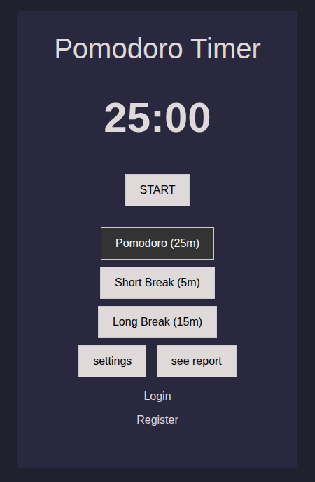

# Basic Pomodoro Timer
   

A basic pomodoro timer, with customizable timer durations and Short-Break, Long-Break modes. Something like a last-minute project for my **NCC** class.


## Pre-requisites
First of all, install the required **npm** packages (for the sake of `typescript`).  
`npm i`

**dotnet packages**
```
    dotnet add package Microsoft.AspNetCore.Identity.EntityFrameworkCore --version 8.0.10
    dotnet add package Microsoft.AspNetCore.Identity.UI --version 8.0.10
    dotnet add package Microsoft.EntityFrameworkCore --version 8.0.10
    dotnet add package Microsoft.EntityFrameworkCore.Design --version 8.0.10
    dotnet add package Npgsql.EntityFrameworkCore.PostgreSQL --version 8.0.10
```

**dotnet tools**
```
    dotnet tool install --global dotnet-ef --version 8.0.10
```


## Getting Started
Transpile Typescript and run the dotnet runtime.
```
    npm run dev
```
